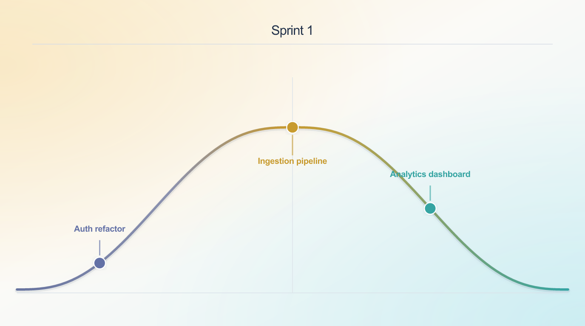

# Hillchart

A Shape Up hill chart tool with a web app and CLI. Visualize where each scope sits between "figuring it out" (uphill) and "in execution" (downhill).

---

## Web App

An interactive browser-based editor. Add milestones, set percentages, and export a PNG — all in real time.

### Setup

```bash
npm install
npm run dev
```

Open [http://localhost:5173](http://localhost:5173).

### Features

- **Milestones** — add up to 15 named scopes and position them on the hill using a percentage (0–100)
- **Live preview** — the chart updates as you type
- **Export PNG** — copies the chart to your clipboard, or downloads it if the Clipboard API is unavailable
- **Persistent state** — chart data is saved to `localStorage` and restored on reload
- **Reset** — clear all milestones and the title back to defaults

### How to use

1. Set a chart title
2. Add milestone names — one per row
3. Set a percentage for each (see placement guide below)
4. Click **Copy PNG** to export

### Placement guide

| Range | Meaning |
|-------|---------|
| 0–35  | Still figuring out the problem or approach |
| 36–49 | Approaching clarity, important unknowns remain |
| 50    | Crest — path is clear |
| 51–69 | Implementation path known, meaningful execution remains |
| 70–84 | Largely in place, in review / QA / stabilization |
| 85–94 | QA exercised, remaining work is fixes / hardening |
| 95–100 | Effectively done, accepted, or trivial wrap-up remains |

---

## CLI

Manage hill charts from the terminal. Each command re-renders the chart as a PNG. Open it in Preview once and leave it — it live-reloads on every update.

### Setup

```bash
npm install

# Optional: alias for convenience
alias hill="npm run hill --prefix ~/dev/hillchart --"
```

### Commands

```bash
hill init [title]              # create hill.json in the current directory
hill add <name> [--pos 0-100]  # add a scope (default position: 0)
hill move <name> <0-100>       # move a scope along the hill
hill done <name>               # mark a scope complete (removes it)
hill list                      # list all scopes with positions
hill show                      # render PNG and open in Preview
hill export [output.png]       # export PNG to a custom path
```

### Example workflow

```bash
cd my-project

hill init "Sprint 5"
hill add "Auth refactor" --pos 15
hill add "Ingestion pipeline" --pos 50
hill add "Analytics dashboard" --pos 75

hill show                        # opens in Preview — leave it open

hill move "Auth refactor" 45     # Preview updates live
hill done "Analytics dashboard"
```

### Output



---

## Development

```bash
npm test        # unit tests (Vitest)
npm run build   # production build
```
